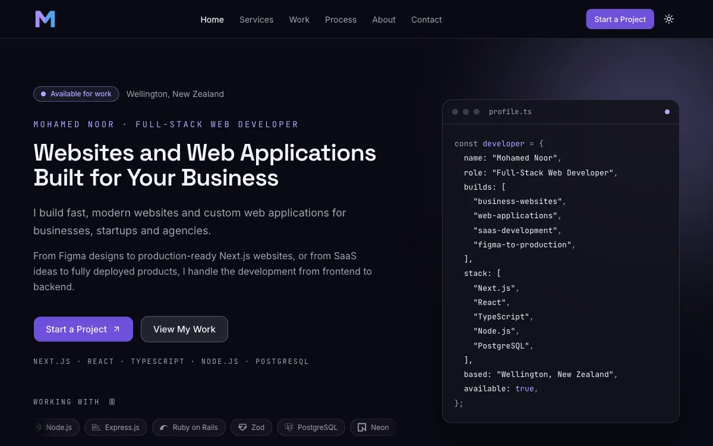
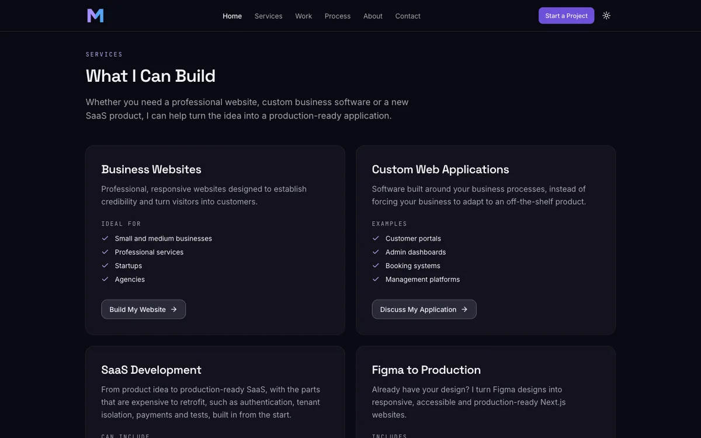
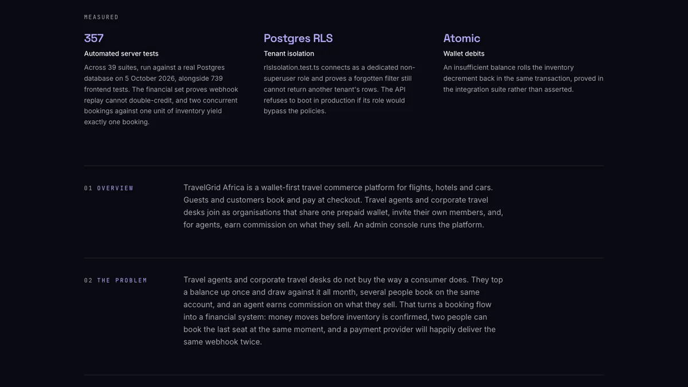
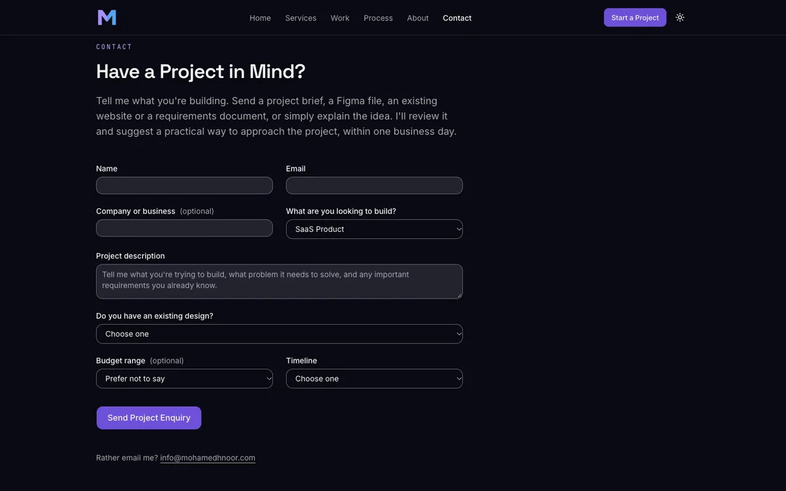

# mohamedhnoor.com

> The portfolio of a full-stack web developer in Wellington, New Zealand: a production Next.js site that turns visitors from search, LinkedIn and GitHub into project enquiries from businesses, startups and agencies.

[**Live Demo →**](https://www.mohamedhnoor.com) · [**Case Study →**](https://www.mohamedhnoor.com/projects/portfolio-site)

---

## Overview

A portfolio for an independent developer who builds websites and custom web applications for businesses, startups and agencies across New Zealand, Australia and internationally. Without public reviews to point at, the site has to prove capability from the work itself, so every project is a full case study and every number names the measurement behind it. Visitors can read the services, study the case studies, and start a project through a qualifying enquiry form. The site is also a work sample: its own accessibility and performance scores are treated as build gates.

---

## Key Features

* Four services, each with a call to action that opens the enquiry form with that project type already chosen
* Ten-part case studies, from the problem to the outcome, each ending in a Start a Project call to action
* A work index filterable by service and by technology
* A process page with seven steps and a milestone-based model
* A qualifying enquiry form covering project type, existing design, an optional NZD budget range and a timeline, delivered by email
* Technology grouped by purpose, with the real work each one was used on
* A print-optimised resume
* Light and dark themes, generated social images, a sitemap and structured data

---

## Engineering Highlights

* Every route is statically generated; the only server work is the contact form's Server Action
* One Zod schema validates an enquiry in the browser and again on the server
* All copy lives in typed content modules with invariants checked at build time, so a malformed entry fails the build instead of rendering an empty section
* Colour contrast is a test: every theme token is converted from oklch to sRGB, and the test suite fails if a pair drops below its WCAG threshold
* Security headers, including a Content Security Policy, are served without middleware so routes stay static
* A deploy gate refuses a production build while any project is still seeded example content
* Email delivery is idempotent: a retry cannot send twice, and a corrected resend is not dropped
* Social images and structured data are generated at build time from the content layer
* Animation is code-split through LazyMotion and collapses under reduced motion

---

## Technology

**Frontend**

`Next.js 16` · `React 19` · `React Compiler` · `TypeScript` · `Tailwind CSS v4` · `shadcn/ui` · `Motion`

**Forms and email**

`Server Actions` · `React Hook Form` · `Zod` · `Resend`

**Testing and quality**

`Vitest` · `axe-core` · `Lighthouse`

**Infrastructure**

`Vercel`

---

## Architecture

```text
Typed content modules (src/content)
   ↓  invariants checked at build time
Next.js App Router, server components
   ↓  every route statically generated
Static pages on Vercel, with security headers from next.config.ts
   ↓
Contact form → Server Action → Zod re-validation → Resend
```

---

## Testing

* The contact schema and Server Action, with Resend mocked: failing closed on missing configuration, the honeypot, idempotency keys and the email a visitor's enquiry produces
* Content invariants: slugs, case study structure, service and project consistency, dates
* Contrast of every theme token pair, in both themes
* Page metadata, the sitemap, structured data and link helpers
* The deploy gate and the rate limiter
* In the browser: axe on every route in both themes, and Lighthouse on the mobile preset

**Test coverage / count:** `336 automated tests` (Vitest, October 2026)

---

## Security

* A Content Security Policy, HSTS, `nosniff`, `Referrer-Policy`, `X-Frame-Options` and `Permissions-Policy` on every route
* Every enquiry is re-validated on the server; the browser's parse is never trusted
* The one submitted value that reaches an email header is stripped of line breaks
* A honeypot field, answered with a decoy success so a bot learns nothing
* Missing email configuration fails closed and offers a direct address, without naming the missing variable
* Provider errors are logged by name only and never shown to a visitor
* A light, per-instance rate limit on the enquiry form

---

## My Role

**Role: Sole Developer**

Responsible for:

* Adapting the design reference
* Frontend development
* The content layer
* The contact form and its Server Action
* Accessibility and performance work
* Testing
* Deployment configuration

---

## Challenges & Solutions

### Proving capability without reviews

A developer with no public reviews has to win work on evidence alone, and the design reference this site started from carried a client-count statistic and skill percentage bars that could not be true.

**Solution:** The invented statistics came out. Every number on the site names the measurement behind it, and the claims that matter most are enforced mechanically rather than by review: colour contrast by the test suite, and the absence of seeded content by the production build.

### A Content Security Policy without losing static generation

A nonce-based policy needs middleware, and middleware would make every route dynamic.

**Solution:** A static policy served from `next.config.ts`, with `eval` allowed in development only for React's error overlay. Tests pin its directives, so loosening one fails the test suite.

### Email that is neither duplicated nor lost

An idempotency key built from only part of an enquiry treated a corrected resend as a conflicting request, and the corrected enquiry was silently dropped.

**Solution:** The key hashes every field that reaches the email. An identical retry still deduplicates, and a corrected one sends.

---

## Results

* `336` automated tests
* `100/100` Lighthouse accessibility, best practices and SEO on the mobile preset
* `0` axe violations across 11 routes in both themes
* `88 ms` Largest Contentful Paint in a real browser at mobile viewport, with layout shift at `0`
* `264 to 270 KB` of JavaScript per route, under a 300 KB budget
* Every route statically generated

---

## Screenshots

**Home page:** the positioning, both calls to action and the primary stack.



**Services:** four services, each with a call to action that opens the enquiry form with that project type chosen.



**Case study:** measured results with the evidence behind each number, then the numbered sections.



**Enquiry form:** opened from a case study with the project type already selected.



---

## Development

### Commands

```bash
npm run dev        # dev server at http://localhost:3000
npm run build      # production build
npm run start      # serve the production build
npm test           # vitest, single run
npm run preflight  # production build with the deploy gate on
npm run lint       # eslint
npx tsc --noEmit   # typecheck
```

`npm run preflight` fails while any project is still seeded example content. See
[Deploying](#deploying).

### Content

All site content lives in typed modules under `src/content/`. Editing the site's
text, projects, skills, and experience does not require touching components.

### Environment

Copy `.env.example` to `.env` and fill in the values. The contact form needs a
Resend API key and a verified sender domain to deliver mail in production. Every
variable is documented in the table under [Deploying](#deploying).

### Deploying

Nothing here deploys anything. This is the runbook for the person who does.

#### Vercel settings

Import the repository and take the defaults. The framework preset is detected as
Next.js, the build command is `npm run build`, and the install command is
`npm install`.

- **No `vercel.json` is needed**, and none exists. A standard Next.js App Router
  project needs no routing, rewrite, or function configuration, and this one has
  no database, storage, workers, or cron jobs. Do not add one speculatively.
- **No Node version is pinned** in `engines`. Vercel tracks a supported LTS on
  its own, and a pin invented here could fail a build on a version this project
  has never been tested against.
- Security response headers come from `next.config.ts`, which Vercel translates
  into its own routing config. They are not configured in the dashboard.

#### Environment variables

Set all four in the Vercel project before the first production build.

| Variable | Needed | What breaks without it |
|---|---|---|
| `NEXT_PUBLIC_SITE_URL` | build time | The production build fails, naming the variable. |
| `RESEND_API_KEY` | request time | Contact fails closed: the visitor sees the direct email address instead. |
| `CONTACT_TO_EMAIL` | request time | Same. |
| `CONTACT_FROM_EMAIL` | request time | Same. |

`NEXT_PUBLIC_SITE_URL` must be the final origin, scheme and host only, with no
path, query string, or trailing slash. **Set it before the first production
build, not after.** Canonical URLs, the sitemap, and both social images are baked
at build time, so changing it later requires a rebuild to take effect.

The three Resend variables are read only when the contact Server Action runs
(`src/actions/contact.ts`). A deploy missing them degrades rather than breaking:
the form fails closed, logs no variable name, and shows the mailto fallback.

#### The deploy gate

`src/lib/deploy-readiness.ts` refuses a production build while any project in
`src/content/projects.ts` carries `isPlaceholder: true`. Since feature 14 replaced
the seeded projects with real work, **no project carries the flag and
`npm run preflight` exits 0.** The guard stays because the next project added has
to clear the same bar: `project-plan.md` states that no project may ship to
production with the flag set.

Preview deploys are not gated, so the site can be reviewed on Vercel before its
content is real. Run `npm run preflight` locally to get the same answer.

#### Smoke tests, after a deploy

Cheapest first.

1. Every URL in `/sitemap.xml` returns 200.
2. `/sitemap.xml` lists eleven URLs, all on the production origin: nine static
   routes plus one per project.
3. `/robots.txt` names that sitemap at the same origin.
4. `/opengraph-image` renders, and so does one case study's image.
5. View source on `/`: the canonical points at the production origin, not
   localhost or a `vercel.app` preview host.
6. Response headers on any route include `Content-Security-Policy`,
   `Strict-Transport-Security`, `X-Content-Type-Options`, `Referrer-Policy`,
   `X-Frame-Options`, and `Permissions-Policy`.
7. The browser console is free of CSP violations on `/`, a case study, and
   `/contact`.
8. The theme toggle works and a reload does not flash the wrong theme. This is
   the check that catches a CSP blocking the pre-paint script.
9. Submit the contact form for real and confirm the mail arrives.
10. The mailto fallback on `/contact` opens a mail client.
11. An unknown URL renders the 404 page.
12. `/resume` prints correctly, and its CV download either resolves or is absent.
13. Re-run Lighthouse mobile and compare against the numbers recorded in
    [AGENTS.md](AGENTS.md). Two routes measured below 95 locally for reasons
    recorded there; production has Brotli and a CDN, so expect better.

#### Checks nothing can automate

The deploy gate covers projects only. These are real content now, but nothing
mechanical guards them:

- the roles in `src/content/experience.ts`
- the usage context on every entry in `src/content/skills.ts`, including the
  public-repository counts, which drift as repositories are added
- the measured numbers on each case study in `src/content/projects.ts`, which must
  keep matching what was actually measured. TravelGrid's test counts drift as its
  repository grows, so re-run its suites before quoting them again

Read them before launch.

### Working on this project

Agent instructions live in [AGENTS.md](AGENTS.md).

---

## Links

* 🌐 **Live Demo:** [View Project](https://www.mohamedhnoor.com)
* 📖 **Case Study:** [Read Case Study](https://www.mohamedhnoor.com/projects/portfolio-site)
* 💻 **Source Code:** [GitHub](https://github.com/MohamedHNoor/freelancing-portfolio)

---

## Built By

**Mohamed Noor**
Full-Stack Web Developer · Wellington, New Zealand

[Portfolio](https://www.mohamedhnoor.com/) · [LinkedIn](https://www.linkedin.com/in/mohamedhnoor/)
