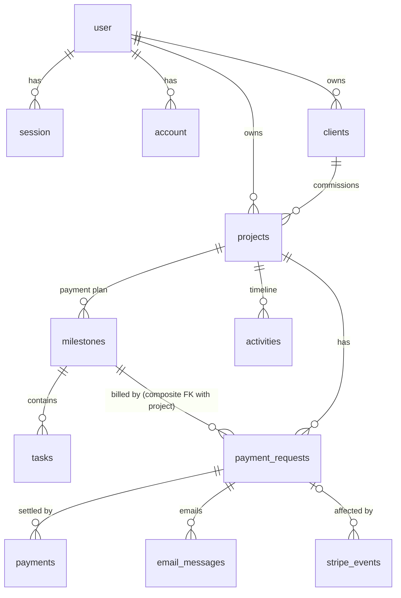

# Business Dashboard Architecture

The approved design reference for build-plan features 15 to 23. `/feature` specs for
those items take their schema, state machines, flows and rules from here; the plans
(`project-plan.md`, `build-plan.md`) stay the owners of scope and order. If a spec has to
depart from this document, update this document in the same feature.

## Context

The developer (solo freelancer, Wellington NZ) needs a private dashboard to manage clients, projects, milestone-based payment plans and tasks, and to collect milestone payments through Stripe Checkout. Payments are confirmed only by verified Stripe webhooks and recorded permanently in Neon. It is a single-owner business tool. It is not a marketplace: no Stripe Connect, payouts or commissions.

It is built **inside this portfolio repo** (Next.js 16.3.4, React 19.2, Tailwind v4, shadcn `radix-nova`, Resend, Vitest 4, npm). Before it, the repo was a fully static public marketing site whose plans said "No database", "No authentication" and "All routes statically generated". The plans were amended for the dashboard, and the first feature restructures the app **with zero change to the public site**. The public routes keep their static generation, CSP, Lighthouse and byte budgets.

Each phase in §33 is one Blueprint feature (`/feature` → `/implement` → `/complete`) on its own branch: phase 1 is build-plan feature 15 and phase 9 is feature 23.

### Decisions
1. **Same repo, isolated by route groups**: the public site moves into `(site)`; the dashboard lives under `/dashboard`, the auth pages under `(auth)`, and public payment pages under `/pay` and `/payment`.
2. **Milestone work status and payment status are separate.** The milestone stores work status only. Payment status is derived from payment requests and payments.
3. **Stable pay link**: emails link to `/pay/{token}` (a "Review & Pay" page), which reuses the open Checkout Session or creates a fresh one. It never expires while the request is open.
4. **Invoice in the MVP**: an itemized email with an invoice number, plus Stripe's post-payment invoice and receipt (`invoice_creation`). Generated PDF invoices are on the roadmap.

### Recommendations adopted
| # | Decision | Why |
|---|---|---|
| R1 | Money as **integer minor units** (`bigint`, cents), percentages as **integer basis points** (3000 = 30.00%) | Exact arithmetic with no floats or decimals in JS. Stripe takes integer `unit_amount` |
| R2 | DB driver: **`pg` (node-postgres) + `drizzle-orm/node-postgres` + `attachDatabasePool`** (from `@vercel/functions`) on Neon's pooled URL | Neon's current guidance for Vercel Fluid compute. It supports interactive transactions, which webhook idempotency needs (`neon-http` does not) |
| R3 | **No `proxy.ts`**: every page, action and query authenticates through a Data Access Layer | Repo rule: no middleware. Next/Better Auth docs say proxy checks are only optimistic anyway |
| R4 | Registration is **owner-only**: allowed only for `OWNER_EMAIL` and only while no user exists, with email verification required | Single-user app; a public sign-up form on a public domain would otherwise be open |
| R5 | Auth and all forms go through **Server Actions** (Better Auth `nextCookies()` plugin) rather than the Better Auth React client | Matches the repo's `src/actions/contact.ts` pattern and keeps client JS small |
| R6 | Financial totals are **derived by SQL aggregates on read** and never stored as counters | Server-derived values that cannot drift |
| R7 | Dashboard totals are **grouped by currency**, never summed across currencies | No FX conversion in v1 |
| R8 | Vercel Functions region **syd1** and Neon region **aws-ap-southeast-2 (Sydney)** | Closest to you and to AU/NZ clients; the DB and functions share a region |
| R9 | Reuse `NEXT_PUBLIC_SITE_URL` as the app URL and **drop `NEXT_PUBLIC_STRIPE_PUBLISHABLE_KEY`** | Same origin; hosted Checkout is a server redirect, so Stripe.js never loads |
| R10 | Stripe account is assumed to be a **NZ Stripe account** (settles NZD); ZAR/AUD/USD/GBP charged as presentment currencies | Stripe is fully supported in NZ. **It is not directly available to South African businesses** (only via Paystack), so this matters if the account were ever SA-based |

---

## 1. Architecture overview

```
                     ┌──────────────────────── Next.js 16 app (one Vercel project) ─────────────────────────┐
 Public visitors ──▶ │ (site)/*   static marketing pages (unchanged, statically generated)                   │
 Client (no acct) ─▶ │ /pay/[token]  Review & Pay page ──server action──▶ Stripe Checkout (hosted)            │
                     │ /payment/success  read-only status page                                              │
 Owner ────────────▶ │ (auth)/*  login, register, forgot/reset ──▶ Better Auth (/api/auth/[...all])         │
                     │ /dashboard/*  RSC pages ─▶ src/server/queries (owner-scoped reads)                   │
                     │                forms ───▶ src/actions/* ─▶ src/server/services/* (transactions)       │
 Stripe ───────────▶ │ /api/stripe/webhook  verify signature ─▶ idempotent fulfilment (transaction)         │
                     └───────────┬──────────────────────────┬────────────────────────────┬───────────────────┘
                                 ▼                          ▼                            ▼
                     Neon Postgres (truth)        Stripe (payment processing)    Resend (email delivery)
```

Layers inside the app:
- **Pages (RSC)** render server-derived view models and hold no business logic.
- **`src/actions/*`** (`'use server'`) are thin. Each one: authenticate → Zod-parse → call a service → `revalidatePath` → return `ActionResult<T>`.
- **`src/server/services/*`** (`server-only`) hold domain logic. They own DB transactions, state-machine guards and activity writes, and call Stripe and Resend through adapters.
- **`src/server/queries/*`** (`server-only`) are owner-scoped read models and financial aggregates.
- **`src/lib/*`** holds pure, unit-tested logic: money, allocation, progress, state machines, payment-status derivation.
- **Adapters**: `src/lib/stripe.ts`, `src/lib/resend.ts` (mail sender), and `src/lib/auth.ts`.

Sources of truth: business state in **Neon**, payment processing in **Stripe**, identity in **Better Auth** (same Neon DB), email delivery in **Resend**.

## 2. Technology decisions

| Concern | Choice | Notes |
|---|---|---|
| Framework | Next.js 16.3 App Router (existing), React 19.2, React Compiler on | Dashboard routes are dynamic; public routes stay static |
| Auth | Better Auth (pin latest 1.6.x) + `drizzleAdapter(db, { provider: "pg" })` + `nextCookies()` | Email/password, verification, reset, DB-backed rate limit |
| DB | Neon Postgres 17, `pg` Pool + `attachDatabasePool` | Pooled URL at runtime, direct URL for migrations |
| ORM | Drizzle ORM + Drizzle Kit, `casing: "snake_case"` | SQL migrations committed under `drizzle/` |
| Payments | `stripe` (stripe-node), API version pinned to the SDK default; the webhook endpoint uses the same version | Hosted Checkout, `mode: "payment"` |
| Email | Resend (existing dep) + React Email (`@react-email/components`) templates | Idempotency keys, already used in `contact.ts` |
| Validation | Zod, staying on the repo's installed 3.25 API (`import { z } from "zod"`) | Upgrading Zod is a separate decision |
| Forms | react-hook-form + `@hookform/resolvers` (existing pattern in `ContactForm.tsx`) | Shared schema for client and server |
| UI | Existing shadcn setup. Add: sidebar, table, dialog, alert-dialog, dropdown-menu, select, tabs, sonner, checkbox, progress, popover, calendar, separator, skeleton, tooltip, breadcrumb | Sidebar and chart tokens already exist in `globals.css` |
| Reordering | `@dnd-kit/core` + `@dnd-kit/sortable`, plus keyboard Move up/down buttons | Accessible reordering |
| Tests | Vitest unit (existing) + Vitest integration project (real Postgres) + Playwright E2E (via `/browser-tests`) | |
| Observability | Sentry (`@sentry/nextjs`, PII scrubbing) + Vercel logs + Stripe webhook failure alerts | Phase 9 |

New dependencies: `better-auth drizzle-orm pg @vercel/functions stripe @react-email/components server-only @dnd-kit/core @dnd-kit/sortable @dnd-kit/utilities`.
New dev dependencies: `drizzle-kit @types/pg react-email`, plus `@playwright/test` (via `/browser-tests`).

## 3. Database ERD



Ownership chain: `user → clients/projects (owner_id) → milestones → tasks`, `projects → payment_requests → payments`.

## 4. Complete database schema

Conventions:
- Primary keys are `uuid DEFAULT gen_random_uuid()`. The exception is the Better Auth tables, whose ids are `text` as Better Auth generates them.
- Every table has `created_at`/`updated_at` as `timestamptz NOT NULL DEFAULT now()` (`updated_at` via Drizzle `$onUpdate`).
- Money is `bigint` (Drizzle `mode: "number"`, validated with `Number.isSafeInteger`).
- Calendar dates are `date` (no timezone) and are interpreted in `Pacific/Auckland`.

### Enums (`pgEnum`)
| Enum | Values |
|---|---|
| `currency` | `ZAR, NZD, AUD, USD, GBP` (add values later with `ALTER TYPE ... ADD VALUE`) |
| `project_status` | `draft, active, on_hold, completed, cancelled` |
| `milestone_status` (work only) | `pending, in_progress, completed, cancelled` |
| `milestone_billing_trigger` | `upfront` (deposit: billable once the project is active), `on_completion` |
| `milestone_pricing_mode` | `percentage, fixed` |
| `task_status` | `pending, in_progress, completed, blocked, cancelled` |
| `payment_request_status` | `pending, requested, processing, paid, failed, cancelled, refunded` |
| `payment_status` | `succeeded, partially_refunded, refunded` |
| `activity_actor` | `owner, client, stripe, system` |
| `activity_type` | `client_created, client_updated, client_archived, project_created, project_updated, project_status_changed, payment_plan_changed, milestone_created, milestone_updated, milestone_started, milestone_completed, milestone_reopened, milestone_cancelled, task_created, task_status_changed, task_deleted, payment_request_created, payment_request_sent, payment_request_cancelled, payment_reminder_sent, checkout_started, payment_processing, payment_received, payment_failed, payment_refunded, payment_disputed, payment_anomaly, email_failed` |
| `email_kind` | `payment_request, payment_reminder, payment_received_owner, payment_failed_owner, payment_alert_owner` |
| `email_status` | `queued, sent, failed` |
| `stripe_event_outcome` | `processed, ignored` |

Sequence: `invoice_number_seq` (`pgSequence`). It formats as `INV-{YYYY}-{00042}`. It is global and monotonic, and gaps are acceptable.

### Better Auth tables (generated by `npm run auth:generate` with pinned `auth@1.6.33`, committed to `src/db/schema/auth.ts`)
| Table | Key columns |
|---|---|
| `user` | `id text PK`, `name text`, `email text UNIQUE`, `email_verified boolean`, `image text?`, timestamps |
| `session` | `id text PK`, `user_id → user.id ON DELETE CASCADE`, `token text UNIQUE`, `expires_at`, `ip_address`, `user_agent`, timestamps |
| `account` | `id text PK`, `user_id → user CASCADE`, `account_id`, `provider_id`, `password` (hash), token columns, timestamps |
| `verification` | `id text PK`, `identifier`, `value`, `expires_at`, timestamps |
| `rate_limit` | `id`, `key UNIQUE`, `count int`, `last_request bigint` (from `rateLimit.storage: "database"`) |
| *(phase 9)* `two_factor` | added by the `twoFactor` plugin |

### `clients`
| Column | Type | Constraints |
|---|---|---|
| id | uuid | PK |
| owner_id | text | NOT NULL, FK `user.id` ON DELETE RESTRICT |
| name | text | NOT NULL (contact person) |
| email | text | NOT NULL, stored lowercased |
| phone | text | NULL |
| company_name | text | NULL |
| country_code | char(2) | NULL, ISO 3166-1 alpha-2 |
| default_currency | currency | NOT NULL (pre-fills new projects) |
| address_line1, address_line2, city, region, postal_code | text | NULL (synced to the Stripe Customer address) |
| notes | text | NULL |
| stripe_customer_id | text | NULL, UNIQUE |
| archived_at | timestamptz | NULL (soft delete) |
| created_at, updated_at | timestamptz | |

Indexes: `(owner_id, archived_at)`, `(owner_id, name)`.

### `projects`
| Column | Type | Constraints |
|---|---|---|
| id | uuid | PK |
| owner_id | text | NOT NULL, FK `user.id` RESTRICT |
| client_id | uuid | NOT NULL, FK `clients.id` RESTRICT |
| name | text | NOT NULL |
| description | text | NULL (scope summary) |
| status | project_status | NOT NULL DEFAULT `draft` |
| currency | currency | NOT NULL, immutable once any payment request exists (service rule) |
| total_amount_minor | bigint | NOT NULL, CHECK `> 0` |
| start_date, expected_end_date | date | NULL, CHECK `expected_end_date >= start_date` |
| activated_at, completed_at, cancelled_at | timestamptz | NULL |
| created_at, updated_at | timestamptz | |

Indexes: `(owner_id, status)`, `(client_id)`.

### `milestones` (the payment plan; the deposit is milestone position 0 with `billing_trigger = upfront`)
| Column | Type | Constraints |
|---|---|---|
| id | uuid | PK |
| project_id | uuid | NOT NULL, FK `projects.id` ON DELETE CASCADE |
| name | text | NOT NULL |
| description | text | NULL |
| position | integer | NOT NULL, CHECK `>= 0` |
| billing_trigger | milestone_billing_trigger | NOT NULL DEFAULT `on_completion` |
| pricing_mode | milestone_pricing_mode | NOT NULL |
| percentage_bps | integer | NULL, CHECK `BETWEEN 1 AND 10000` |
| amount_minor | bigint | NOT NULL, CHECK `> 0`. Always concrete; for percentage mode it is computed server-side |
| status | milestone_status | NOT NULL DEFAULT `pending` |
| due_date | date | NULL |
| started_at, completed_at, cancelled_at | timestamptz | NULL |
| created_at, updated_at | timestamptz | |

Constraints: `UNIQUE (id, project_id)` (target of the composite FK below), and `CHECK ((pricing_mode = 'percentage') = (percentage_bps IS NOT NULL))`.
Index: `(project_id, position)`. Position is rewritten inside a transaction on reorder, so there is no unique constraint on it.

### `tasks`
| Column | Type | Constraints |
|---|---|---|
| id | uuid | PK |
| milestone_id | uuid | NOT NULL, FK `milestones.id` ON DELETE CASCADE |
| title | text | NOT NULL (1-200 chars, validated) |
| description | text | NULL |
| position | integer | NOT NULL |
| status | task_status | NOT NULL DEFAULT `pending` |
| completed_at | timestamptz | NULL |
| created_at, updated_at | timestamptz | |

Index: `(milestone_id, position)`.

### `payment_requests`
| Column | Type | Constraints |
|---|---|---|
| id | uuid | PK |
| project_id | uuid | NOT NULL, FK `projects.id` RESTRICT |
| milestone_id | uuid | NOT NULL; **composite FK `(milestone_id, project_id)` → `milestones(id, project_id)` RESTRICT**, so a request can never point at another project's milestone |
| invoice_number | text | NOT NULL, UNIQUE |
| amount_minor | bigint | NOT NULL, CHECK `> 0` (service rule: `<=` milestone outstanding) |
| currency | currency | NOT NULL (copied from the project) |
| description | text | NOT NULL (line-item snapshot, e.g. "Backend Development") |
| status | payment_request_status | NOT NULL DEFAULT `pending` |
| public_token | text | NOT NULL, UNIQUE (256-bit random, base64url, 43 chars) |
| due_date | date | NULL |
| stripe_checkout_session_id | text | NULL, UNIQUE (the current session) |
| checkout_url | text | NULL |
| checkout_expires_at | timestamptz | NULL |
| checkout_attempt | integer | NOT NULL DEFAULT 0 (part of the Stripe idempotency key) |
| stripe_payment_intent_id | text | NULL, UNIQUE |
| requested_at, paid_at, failed_at, cancelled_at, refunded_at | timestamptz | NULL |
| last_reminded_at | timestamptz | NULL |
| reminder_count | integer | NOT NULL DEFAULT 0 |
| last_error_code | text | NULL (sanitized Stripe error code only) |
| created_at, updated_at | timestamptz | |

Indexes:
- **Partial unique index `(milestone_id) WHERE status IN ('pending','requested','processing','failed')`**: at most one open request per milestone, which stops duplicate requests at the DB level.
- `(project_id, status)` and `(status, due_date)`.

### `payments` (money actually received; separate from requests)
| Column | Type | Constraints |
|---|---|---|
| id | uuid | PK |
| payment_request_id | uuid | NOT NULL, FK `payment_requests.id` RESTRICT |
| project_id | uuid | NOT NULL, FK `projects.id` RESTRICT (immutable copy for aggregates) |
| milestone_id | uuid | NOT NULL, FK `milestones.id` RESTRICT |
| amount_minor | bigint | NOT NULL, CHECK `> 0` (Stripe `amount_total`) |
| amount_refunded_minor | bigint | NOT NULL DEFAULT 0, CHECK `BETWEEN 0 AND amount_minor` |
| currency | currency | NOT NULL |
| status | payment_status | NOT NULL DEFAULT `succeeded` |
| stripe_checkout_session_id | text | NOT NULL, **UNIQUE** |
| stripe_payment_intent_id | text | NOT NULL, **UNIQUE** (the main dedupe key) |
| stripe_charge_id | text | NULL, UNIQUE |
| paid_at | timestamptz | NOT NULL |
| refunded_at, disputed_at | timestamptz | NULL (a dispute is a flag, not a status; disputes can be won) |
| created_at, updated_at | timestamptz | |

Index: `(project_id, paid_at DESC)`. No card data is ever stored.

### `stripe_events` (webhook idempotency ledger)
| Column | Type | Constraints |
|---|---|---|
| id | text | PK (`evt_...`) |
| type | text | NOT NULL |
| livemode | boolean | NOT NULL |
| stripe_created_at | timestamptz | NOT NULL |
| outcome | stripe_event_outcome | NOT NULL |
| payment_request_id | uuid | NULL, FK ON DELETE SET NULL |
| processed_at | timestamptz | NOT NULL DEFAULT now() |

The full payload is not stored, because it contains PII.

### `activities` (append-only audit trail)
| Column | Type | Constraints |
|---|---|---|
| id | uuid | PK |
| owner_id | text | NOT NULL, FK `user.id` RESTRICT |
| client_id | uuid | NULL, FK SET NULL |
| project_id | uuid | NULL, FK CASCADE |
| milestone_id, task_id, payment_request_id | uuid | NULL, FK SET NULL |
| type | activity_type | NOT NULL |
| actor | activity_actor | NOT NULL |
| summary | text | NOT NULL (rendered at write time, so it survives renames) |
| data | jsonb | NOT NULL DEFAULT `'{}'`, typed per `type` by a Zod discriminated union (amounts in minor units plus currency) |
| occurred_at | timestamptz | NOT NULL DEFAULT now() |

Indexes: `(project_id, occurred_at DESC)`, `(owner_id, occurred_at DESC)`. No update or delete paths exist.

### `email_messages` (notification log; the extension point for other channels)
| Column | Type | Constraints |
|---|---|---|
| id | uuid | PK |
| owner_id | text | NOT NULL |
| kind | email_kind | NOT NULL |
| status | email_status | NOT NULL DEFAULT `queued` |
| to_email, subject | text | NOT NULL |
| payment_request_id | uuid | NULL, FK SET NULL |
| project_id | uuid | NULL, FK SET NULL |
| idempotency_key | text | NOT NULL, UNIQUE (also sent to Resend) |
| resend_email_id | text | NULL |
| error_code | text | NULL |
| sent_at | timestamptz | NULL |
| created_at | timestamptz | |

Index: `(payment_request_id, created_at DESC)`.

### Money rules and derived figures (pure functions in `src/lib/money.ts`, `src/lib/finance.ts`, all unit-tested)
- **Parsing**: `parseMoney("15,000.50", "ZAR") → 1500050`. String-based with no `parseFloat`; at most 2 decimals; exponents come from a per-currency table (all five currencies use 2).
- **Formatting**: done server-side only, with an explicit locale per currency (`en-ZA`, `en-NZ`, `en-AU`, `en-US`, `en-GB`). Passing `Intl.NumberFormat` a decimal *string* keeps it exact. Formatting happens on the server so hydration cannot mismatch; `src/lib/dates.ts` follows the same reasoning.
- **Percentage allocation**: `allocate(totalMinor, bpsList)` uses BigInt intermediates and the largest-remainder method. The amounts sum *exactly* to `round(total × Σbps / 10000)` and each is within 1 minor unit of exact; ties go to the later milestone.
- **Plan invariant** (enforced in the service under `SELECT ... FOR UPDATE` on the project row): Σ `amount_minor` of non-cancelled milestones ≤ `total_amount_minor`. **Activation requires Σ = total.**
- **Frozen milestones**: a milestone with any non-cancelled payment request or payment has a frozen amount. Changing the project total recomputes only unfrozen percentage milestones and is rejected if it would break the invariant.
- **Derived per milestone**: `paid = Σ(payments.amount − amount_refunded)` and `outstanding = amount − paid`. Payment status is derived: `paid` if paid ≥ amount; otherwise from the open request (`processing`, `requested`, `failed`); otherwise `refunded` if refunds exist; otherwise `unbilled`.
- **Derived per project**: `allocated`, `unallocated`, `paid`, `outstanding = total − paid`, `requested` (open requests), `paymentProgress = floor(paid × 100 / total)`.
- **`developmentProgress`**: the amount-weighted average over non-cancelled `on_completion` milestones, where each milestone's progress = 100 if completed, else `floor(done / non-cancelled tasks × 100)`. The deposit is excluded.
- **Billable** (computed): project `active`, milestone not cancelled, `outstanding > 0`, no open request, and (`upfront` or milestone `completed`).
- **Overdue** (computed): request `requested`/`failed` and `due_date < today` (Pacific/Auckland).

## 5. Better Auth integration

`src/lib/auth.ts` (`server-only`):
```ts
betterAuth({
  baseURL: env.BETTER_AUTH_URL, secret: env.BETTER_AUTH_SECRET,
  database: drizzleAdapter(db, { provider: "pg", schema: authSchema }),
  emailAndPassword: { enabled: true, requireEmailVerification: true, minPasswordLength: 12,
    autoSignIn: false, revokeSessionsOnPasswordReset: true, sendResetPassword },
  emailVerification: { sendVerificationEmail, sendOnSignUp: true, autoSignInAfterVerification: true },
  session: { expiresIn: 7 days, updateAge: 1 day },   // no cookieCache: revocation takes effect immediately
  rateLimit: { enabled: true, storage: "database", customRules: { sign-in / sign-up / reset: strict } },
  databaseHooks: { user: { create: { before: ownerOnlySignUp } } }, // throws APIError unless email === OWNER_EMAIL && no user exists
  trustedOrigins: [SITE_URL, preview origin when VERCEL_ENV=preview],
  plugins: [nextCookies()],                            // must stay last
})
```
- **Route**: `src/app/api/auth/[...all]/route.ts` → `export const { GET, POST } = toNextJsHandler(auth)`.
- **Auth emails** (`sendResetPassword`, `sendVerificationEmail`) go through the Resend sender with `void` (not awaited), as Better Auth recommends against timing attacks. They are not logged with their URLs.
- **Server actions** (`src/actions/auth.ts`): `signIn`, `signUp`, `signOut`, `requestPasswordReset`, `resetPassword`, `resendVerification`, each calling `auth.api.*` with `headers: await headers()`.
- **Register page**: a server component that shows the form only while `user` has zero rows, and otherwise shows "Registration is closed". The hook enforces the rule regardless of the page.
- **Owner of data**: `session.user.id` becomes `owner_id`. There is no separate profile table.
- **Phase 9 hardening**: the `twoFactor` (TOTP) plugin plus a sessions list/revoke in Settings.

## 6. Drizzle configuration

- **`drizzle.config.ts`**: PostgreSQL dialect, `schema: "./src/db/schema"`, `out: "./drizzle"`, snake_case casing, strict/verbose. Offline generation loads no private env files and needs no URL. Migration/Studio load Next-compatible env files through the directly declared `@next/env`, then require `DATABASE_URL_UNPOOLED` without runtime/test fallbacks.
- **`src/db/index.ts`** (`server-only`):
  - `getDb()` validates the runtime URL on first access, creates `pg.Pool({ connectionString: DATABASE_URL, max: 5, idleTimeoutMillis: 5000 })`, attaches it once through `attachDatabasePool(pool)`, then caches `drizzle({ client: pool, schema, casing: "snake_case" })` for the process.
  - **It never throws at import.** No config read, pool creation or query occurs until access. Public routes import no database runtime module.
- **`src/db/schema/*.ts`**: one file per table group (`auth, clients, projects, milestones, tasks, payment-requests, payments, activities, email-messages, stripe-events, enums`), plus `src/db/relations.ts` for the relational query API and `src/db/schema/index.ts` re-exporting everything.
- **Scripts**: `db:generate` (drizzle-kit generate), `db:migrate` (drizzle-kit migrate), `db:studio`, `auth:generate`.
- Feature 16a supplies only the auth schema group; business groups/relations arrive with their features. See `blueprint/database-setup.md` for the offline generator's timestamp/default adjustments and unapplied migration handoff.

## 7. Neon configuration

- **Project**: one Neon project, Postgres 17, region **aws-ap-southeast-2**.
- **Branches**:
  - `production` is the default branch and is protected.
  - `development` is a child of production, used locally and by Vercel Preview.
  - `test` is used by integration tests and reset before each run.
- **Connection strings**: the pooled URL (`-pooler` host) goes in `DATABASE_URL` for runtime; the direct URL goes in `DATABASE_URL_UNPOOLED` for drizzle-kit and DDL.
- **Scale-to-zero** is acceptable: the cold start is under a second for the dashboard, and Stripe's webhook timeout is generous.
- **Backups**: rely on Neon point-in-time restore (check the history window on your plan), take a manual snapshot before every production migration, and add a weekly `pg_dump` (GitHub Action to private storage) in phase 9. Stripe holds a second, independent record of every payment for reconciliation.

## 8. Stripe architecture

- **`src/lib/stripe.ts`** (`server-only`) creates a lazy singleton with the pinned API version and `appInfo`. It wraps only what the app uses:
  - `ensureCustomer`
  - `createCheckoutSession`
  - `expireCheckoutSession`
  - `retrieveCheckoutSession` (with `expand: ["payment_intent.latest_charge"]`)
  - `constructWebhookEvent`

  Tests mock this module boundary.
- **Restricted key** (`rk_...`) with the minimum permissions: Checkout Sessions write, Customers write, PaymentIntents read, Charges read.
- **Customer**:
  - `ensureCustomer(client)` reuses `stripe_customer_id`. Otherwise it calls `customers.create({ name: company_name ?? name, email, address, metadata: { client_id } }, { idempotencyKey: "customer:{clientId}" })` and then runs `UPDATE ... WHERE stripe_customer_id IS NULL`, which is race-safe.
  - When a request is made, name and email are re-synced with `customers.update`.
- **Checkout Session parameters**:
  - `mode: "payment"`, `customer`, `client_reference_id: paymentRequest.id`.
  - `line_items: [{ quantity: 1, price_data: { currency, unit_amount: amountMinor, product_data: { name: "{project} - {milestone}", description } } }]`.
  - `metadata` and `payment_intent_data.metadata`: `{ payment_request_id, project_id, milestone_id, invoice_number }`.
  - `invoice_creation: { enabled: true, invoice_data: { description, metadata } }`. **Check the current fee for post-payment invoices before go-live; this is one flag to turn off.**
  - `success_url: {SITE}/payment/success?session_id={CHECKOUT_SESSION_ID}`, `cancel_url: {SITE}/pay/{token}?cancelled=1`, `expires_at: now + 24h`.
  - Request option `idempotencyKey: "checkout:{paymentRequestId}:{attempt}"`.
- **Payment methods**: Dashboard-managed dynamic payment methods. Cards are the default; async methods, if enabled, are handled through the `processing` state.
- **Dashboard settings**: Checkout branding (logo, brand colour), customer emails for successful payments (live mode), and one webhook endpoint per mode.
- **No Stripe.js, no Connect, no Elements.** CSP impact is only `form-action` (§29).

## 9. Stripe Checkout flow

```
Owner: Request payment ─▶ createPaymentRequest (Tx A: insert request 'pending')
       ─▶ ensureCustomer ─▶ checkout.sessions.create (idempotent) ─▶ Tx B: 'requested' + session id/url/expiry
       ─▶ Resend email with {SITE}/pay/{token} ─▶ returns pay link (Copy link button)
Client: email "Review & Pay" ─▶ GET /pay/{token} (summary: project, milestone, invoice no., amount, due date)
       ─▶ [Pay securely with Stripe] form POST ─▶ startCheckout(token) server action
            ├ current session valid ≥10 min ─▶ 303 to stored checkout_url
            └ else expire old session (if Stripe reports it 'complete' ─▶ show "confirming payment")
                   ─▶ create session attempt n+1 ─▶ conditional UPDATE (WHERE checkout_attempt = n) ─▶ 303 to Stripe
Client pays on checkout.stripe.com ─▶ redirect to /payment/success (read-only; shows DB status, polls briefly)
Stripe ─▶ POST /api/stripe/webhook ─▶ the only path that marks anything paid
```

Because the previous session is expired before a new one is created, at most one payable session exists per request.

## 10. Stripe webhook architecture

`src/app/api/stripe/webhook/route.ts` (`runtime = "nodejs"`, dynamic):
1. `const body = await req.text()`; reject with **400** if the `stripe-signature` header is missing or `constructEvent(body, sig, STRIPE_WEBHOOK_SECRET)` throws.
2. Ignore (200) events whose `livemode` does not match the key's mode.
3. For checkout events, re-fetch the session from Stripe (`retrieveCheckoutSession`, expanding the PI and charge) *before* opening the transaction. Network calls never run inside a DB transaction.
4. `db.transaction`:
   - `INSERT INTO stripe_events ... ON CONFLICT (id) DO NOTHING RETURNING id`. If no row comes back, the event is a duplicate: commit and return **200**.
   - Dispatch the handler. It locks the payment request `FOR UPDATE`, applies state-machine guards, writes payments and activities, and returns a list of emails to send.
   - Record the outcome (`processed` or `ignored`).
5. After commit, send emails via `after()` from `next/server`. Email failure is logged in `email_messages` and never fails the webhook.
6. Any thrown error → **500**. The transaction rolls back, including the ledger row, so Stripe's automatic retries (up to about 3 days) reprocess cleanly. This also covers out-of-order delivery: a refund that arrives before its payment exists throws and is retried later.

**Minimum event set** (subscribe to exactly these):

| Event | Handling |
|---|---|
| `checkout.session.completed` | Resolve the request via `metadata.payment_request_id` and verify it matches `client_reference_id`. If `payment_status = "paid"`, run **fulfil()**. If `"unpaid"` (async method), move the request to `processing` |
| `checkout.session.async_payment_succeeded` | **fulfil()** |
| `checkout.session.async_payment_failed` | `processing → failed`, owner email. The client can retry from the same link |
| `checkout.session.expired` | If it is the request's current session, clear `checkout_url`/`expires_at`. The request stays `requested` and the link mints a new session |
| `charge.refunded` | Set `payments.amount_refunded_minor = charge.amount_refunded`. The value is absolute, so it is idempotent and order-independent. Update the status; a full refund moves the request to `refunded`. Write an activity |
| `charge.dispute.created` | Set `payments.disputed_at`, write an activity, send an urgent owner email |

`payment_intent.*` events are deliberately not subscribed: they duplicate the Checkout events, and a failed card attempt inside Checkout does not end the session.

**fulfil(session)**, which is idempotent:
- Verify `amount_total === request.amount_minor` and the currency matches. On a mismatch, still record the money and raise a `payment_anomaly` activity plus an owner alert, but do not mark the request paid.
- `INSERT INTO payments ... ON CONFLICT (stripe_payment_intent_id) DO NOTHING`.
- Run `UPDATE payment_requests SET status='paid', paid_at, stripe_payment_intent_id WHERE id = $1 AND status IN ('pending','requested','processing','failed')`.
- If that matches 0 rows and the request is already `paid` by a *different* PI, this is a **duplicate payment**: keep the payment row and send an anomaly alert so you can refund. If the request was `cancelled` (the client paid in a race), mark it paid and raise an anomaly activity. Money received is the truth.
- Write the `payment_received` activity and queue the owner notification. The client gets Stripe's paid invoice and receipt.

**Missed-webhook safety net**: a "Sync with Stripe" action on a request retrieves the session server-side and runs the same `fulfil()`. It verifies with Stripe directly and never trusts the redirect.

## 11. Payment state machines (`src/lib/state/payment-request.ts`, table-driven and unit-tested)

**Payment request**
| From | To | Trigger | Guard |
|---|---|---|---|
| (new) | pending | `createPaymentRequest` | billable (§4), outstanding > 0, no open request (partial unique index) |
| pending | requested | Checkout Session created (same action, or Retry) | Stripe success |
| requested | requested | new session via pay link (`checkout_attempt + 1`) | previous session expired first |
| requested, failed | processing | `checkout.session.completed` with `unpaid` | session belongs to the request |
| pending, requested, processing, failed, (cancelled → anomaly) | paid | `completed` (paid) / `async_payment_succeeded` | amount and currency match |
| processing | failed | `async_payment_failed` | |
| failed | requested | client retries via the link | |
| pending, requested, failed | cancelled | `cancelPaymentRequest` | open session expired first. If Stripe reports it complete, abort and wait for the webhook |
| paid | refunded | `charge.refunded` (full) | |

A partial refund leaves the request `paid`, sets the payment to `partially_refunded`, and raises the milestone's outstanding amount.

**Payment record**: `succeeded → partially_refunded → refunded`. `disputed_at` is an orthogonal flag.

All transitions run as conditional `UPDATE ... WHERE status IN (allowed) RETURNING`. If 0 rows come back, the transition is a `ConflictError`, which makes concurrent clicks and webhook races safe.

## 12. Project state machine
| From | To | Action | Guard |
|---|---|---|---|
| draft | active | Activate | client set, ≥ 1 milestone, **allocated == total** |
| active | on_hold | Pause | |
| on_hold | active | Resume | |
| active | completed | Complete | all non-cancelled milestones `completed` (outstanding may remain and stays visible) |
| completed | active | Reopen | |
| draft, active, on_hold | cancelled | Cancel (confirm dialog) | open requests are cancelled and their sessions expired in the same flow; paid history is kept |
| draft | (deleted) | Delete | no payment requests ever |

Edit rules:
- Currency is locked after the first payment request.
- The total can change only if it stays ≥ paid + open requests + frozen milestones; percentage milestones recompute.

## 13. Milestone state machine (work only)
| From | To | Trigger | Guard |
|---|---|---|---|
| pending | in_progress | "Start", or automatically when the first task leaves `pending` | |
| pending, in_progress | completed | **"Mark milestone complete" (always manual)** | all non-cancelled tasks completed (zero tasks is allowed) |
| completed | in_progress | Reopen | no open payment request (cancel it first) |
| pending, in_progress | cancelled | Cancel | no payments and no open request; its amount becomes unallocated |
| cancelled | pending | Restore | plan invariant still holds |

- **Ready for completion** is computed, not stored: status ≠ completed, ≥ 1 non-cancelled task, and all completed. The UI shows a banner with the button.
- Tasks are read-only while the milestone is `completed` or `cancelled` (reopen to edit).
- Completing a milestone opens a one-click **"Request payment now?"** dialog when it is billable.

## 14. Task state machine
- Transitions between `pending`, `in_progress`, `blocked`, `completed` and `cancelled` are unrestricted. The guard is the parent milestone (not completed or cancelled).
- Entering `completed` sets `completed_at`; leaving it clears it.
- The first task to leave `pending` moves a `pending` milestone to `in_progress`.
- Every change writes a `task_status_changed` activity; the timeline shows only completions by default.

## 15. Authorization strategy

- **`src/server/auth/session.ts`**:
  - `getOwner()` is React `cache()`d per request. It returns `{ userId }` or null via `auth.api.getSession({ headers })`.
  - `requireOwner()` redirects to `/login` in pages and returns an `UNAUTHENTICATED` result in actions.
- **`src/lib/permissions.ts`** holds the owner-scoped loaders used by every service. Each takes `(tx, ownerId, id)`, runs a single query with the ownership join (`... JOIN projects p ON ... WHERE x.id = $id AND p.owner_id = $owner`), and optionally adds `FOR UPDATE`:
  - `ownedClient`
  - `ownedProject`
  - `ownedMilestone` (joins the project)
  - `ownedTask` (joins milestone → project)
  - `ownedPaymentRequest`
- **A missing row and a row owned by someone else both raise `NotFoundError`.** Both surface as 404 or "Not found", so the response never reveals whether a resource exists (IDOR-safe).
- Every browser-supplied id is first validated with `z.string().uuid()`. Ids are never trusted, including `.bind()` arguments.
- Every page and query in `/dashboard` calls `requireOwner()`. The `dashboard/layout.tsx` check is only a convenience, since layouts don't re-run on client navigation.
- **Public surfaces**:
  - `/pay/[token]`: authorization is possession of a 256-bit token. It exposes only the client's own request summary, uses `noindex`, `referrer: no-referrer` and a light per-IP rate limit, and becomes inert once the request is cancelled or paid.
  - The webhook: authorization is the Stripe signature.
- Next.js server actions already enforce Origin/Host matching (CSRF). No `allowedOrigins` loosening.
- Tests seed **two owners** and assert that owner B cannot read or mutate anything of owner A's (§30).

## 16. Server Actions

Every action follows the same pipeline: `requireOwner → schema.safeParse → service (transaction, owner-scoped load FOR UPDATE, guard, write, activity) → post-commit side effects → revalidatePath → ActionResult<T>`.

`ActionResult<T>` reuses the repo's existing shape, moved to `src/types/action.ts`:
`{ success: true, data: T, error: null } | { success: false, data: null, error: { code, message, fieldErrors? } }`.

A small `ownerAction(schema, handler)` helper guarantees the first two steps and the error mapping.

| File | Actions | Key guards / side effects |
|---|---|---|
| `src/actions/clients.ts` | `createClient`, `updateClient`, `archiveClient`, `deleteClient` | Delete only with no projects, otherwise archive. Updating email/name re-syncs Stripe lazily |
| `src/actions/projects.ts` | `createProject` (optional plan preset), `updateProject`, `changeProjectStatus` (`activate, pause, resume, complete, reopen, cancel`), `deleteProject` | Project machine §12; cancel expires sessions |
| `src/actions/milestones.ts` | `createMilestone`, `updateMilestone`, `reorderMilestones`, `deleteMilestone`, `applyPlanPreset` (drafts), `startMilestone`, `completeMilestone`, `reopenMilestone`, `cancelMilestone`, `restoreMilestone` | Plan invariant under project row lock; milestone machine §13 |
| `src/actions/tasks.ts` | `createTask`, `updateTask`, `setTaskStatus` (covers complete, in progress, blocked, cancel), `reorderTasks`, `deleteTask` | Parent milestone editable; auto-start milestone |
| `src/actions/payments.ts` | `createPaymentRequest`, `retryPaymentRequest`, `cancelPaymentRequest`, `sendPaymentReminder`, `syncPaymentRequest` | §25; reminder at most once per 24h unless forced |
| `src/actions/pay.ts` (public) | `startCheckout(token)` | Token lookup, status check, session reuse or create, 303 |
| `src/actions/auth.ts` | `signIn`, `signUp`, `signOut`, `requestPasswordReset`, `resetPassword`, `resendVerification` | Better Auth API; generic error messages |

Plan presets are UI shortcuts only, never hard-coded rules:
- "30% deposit + N equal milestones"
- "50% deposit + N"
- "Fixed amounts"

Each produces editable draft rows.

## 17. Route Handlers
| Route | Purpose |
|---|---|
| `GET/POST /api/auth/[...all]` | Better Auth (sign-in, verify-email link target, reset) |
| `POST /api/stripe/webhook` | Stripe events (§10) |
| *(future)* `GET /api/cron/reminders` | Vercel Cron for overdue reminders, guarded by `CRON_SECRET` |

The pay flow is a page plus a server action, not a GET handler. Email-link scanners that pre-fetch GET URLs therefore cannot create sessions.

## 18. Zod schemas (`src/lib/validation/`, next to the existing `contact.ts`, rather than a new `src/schemas/`)
| File | Schemas |
|---|---|
| `money.ts` | `currencySchema` (enum), `moneyInputSchema` (string → minor int, > 0, safe int), `percentInputSchema` ("12.5" → 1250 bps, 0 < x ≤ 100, ≤ 2 dp), `idSchema` (uuid), `dateInputSchema` (YYYY-MM-DD) |
| `client.ts` | `clientInputSchema` (name 1-120, email lowercased, phone?, companyName?, countryCode? ISO-2, defaultCurrency, address fields?, notes? ≤ 5000) |
| `project.ts` | `projectInputSchema` (clientId, name, description?, currency, total money, startDate?, expectedEndDate? refined ≥ start, preset?), `projectStatusActionSchema` |
| `milestone.ts` | `milestoneInputSchema`, a **discriminated union on `pricingMode`** (`percentage` + percent, or `fixed` + amount), plus billingTrigger, name, description?, dueDate?; `reorderSchema` (ids array); `milestoneTransitionSchema` |
| `task.ts` | `taskInputSchema` (title 1-200, description?), `taskStatusSchema`, `reorderSchema` |
| `payment.ts` | `createPaymentRequestSchema` (milestoneId, dueDate?, note? ≤ 1000, sendEmail boolean), `paymentRequestIdSchema`, `payTokenSchema` (`/^[A-Za-z0-9_-]{43}$/`), `checkoutMetadataSchema` (parses the Stripe `metadata` in the webhook) |
| `activity.ts` | Discriminated union of `data` payloads per `activity_type` |
| `env.ts` (in `src/lib/env.ts`) | Server env schema, parsed lazily on first use; fails closed with a message that never echoes values |

Each schema is shared by its react-hook-form form and its server action, following the existing pattern. Input and output types are exported (`z.input` / `z.output`).

## 19. Next.js route structure

```
src/app/
  layout.tsx                      html/body/fonts/theme script; no marketing provider or skip link
  not-found.tsx                   renders the extracted <SiteChrome> so 404s keep header/footer (shipped)
  robots.ts                       disallows dashboard, payment, auth and API paths
  sitemap.ts, opengraph-image.tsx, icon.svg   unchanged
  (site)/layout.tsx               <SiteChrome>: MotionProvider + SkipLink + Header + main + Footer
  (site)/page.tsx, about/, services/, process/, projects/, projects/[slug]/, skills/, experience/, contact/   (moved; URLs unchanged; shipped)
  resume/layout.tsx               standalone SkipLink; no marketing chrome or Motion
  resume/page.tsx                 outside (site): a standalone document with its own header and <main>
  (auth)/layout.tsx               centred card, noindex
  (auth)/login, register, forgot-password, reset-password, verify-email
  dashboard/layout.tsx            requireOwner, sidebar shell, title template "%s · Dashboard", noindex
  dashboard/page.tsx              overview
  dashboard/clients/page.tsx, new/, [clientId]/page.tsx, [clientId]/edit/
  dashboard/projects/page.tsx, new/, [projectId]/page.tsx, [projectId]/plan/, [projectId]/settings/,
  dashboard/projects/[projectId]/milestones/[milestoneId]/page.tsx
  dashboard/payments/page.tsx     requests + payments tabs, filters
  dashboard/settings/page.tsx     profile, password, sessions, (2FA)
  pay/[token]/page.tsx            public Review & Pay
  payment/success/page.tsx        public, read-only
  api/auth/[...all]/route.ts, api/stripe/webhook/route.ts
```

The route group shipped early, on 2026-10-06, with the resume rework (`blueprint/history/fixes/recruiter-resume.md`). It differs from the plan as first written in three ways. `/resume` sits outside `(site)`, because a resume must not carry the marketing navigation. `MotionProvider` and `SkipLink` initially stayed in the root layout. Feature 15 moves them into `SiteChrome`, with a separate skip link in the resume layout. Future auth, dashboard and payment layouts must own their skip links and `#main-content`; the root carries only the shared document shell. And `opengraph-image` files inside a group get a hashed suffix from Next (`/projects/[slug]/opengraph-image-umay0l`), so the case-study image URLs changed once; the root `/opengraph-image` did not, and `/` now attaches it through `routeMetadata` like every other route.

Project pages live under `/dashboard/projects/[projectId]` because the public `/projects/[slug]` already exists. Each dashboard segment has its own `loading.tsx`, `error.tsx` and scoped `not-found.tsx`.

## 20. Component architecture

The existing `src/components/projects/` belongs to the portfolio case studies, so the dashboard gets its own namespace:
```
src/components/dashboard/
  shell/      AppSidebar, Topbar, Breadcrumbs, UserMenu
  shared/     StatusBadge (StatusPill pattern: the label carries meaning, colour reinforces), MoneyAmount (tabular-nums),
              ProgressMeter (labelled role=progressbar), StatCard, EmptyState, ConfirmDialog, CopyLinkButton, DataTable
  overview/   CurrencySummary, PendingRequestsCard, DeadlinesCard, RecentPaymentsCard, RecentMilestonesCard
  clients/    ClientForm, ClientTable, ClientSummary
  projects/   ProjectForm, ProjectTable, ProjectHeader, ProgressPair (development vs payment), PaymentPlanTable, PlanEditor, PlanPresetPicker
  milestones/ MilestoneHeader, ReadyForCompletionBanner, MilestonePaymentPanel, PaymentHistory
  tasks/      TaskList (dnd-kit + useOptimistic), TaskRow, TaskStatusMenu, AddTaskInput
  payments/   RequestPaymentDialog, PaymentRequestTable, PaymentRequestRow, ReminderButton
  activity/   ActivityTimeline, ActivityItem
src/components/pay/      PaySummary, PayButton, PaymentStatusNotice
src/components/auth/     LoginForm, RegisterForm, ForgotPasswordForm, ResetPasswordForm
src/emails/              React Email templates (§26)
src/server/              auth/session.ts, queries/{dashboard,clients,projects,milestones,payments,activity,finance}.ts,
                         services/{clients,projects,payment-plan,milestones,tasks,payment-requests,checkout,stripe-webhook,activity,notifications}.ts
```
- Server components by default. Client components are leaves only: forms, task list, dialogs, copy button and the success-page poller.
- Server-derived and pre-formatted values are passed down as props; the client never computes money.
- The dashboard does not use Motion.

## 21. UI/UX screen list
1. Login. 2. Register (owner-only, or "closed"). 3. Forgot password. 4. Reset password. 5. Verify-email notice.
6. **Dashboard overview**.
7. Clients list. 8. Client new/edit. 9. Client detail (projects, totals per currency).
10. Projects list (status tabs). 11. **New project** (client → details and total → payment plan preset, on one page). 12. **Project detail**. 13. **Payment plan editor**. 14. Project settings (edit, status, delete).
15. **Milestone detail**.
16. Payments (requests and payments tabs, overdue filter).
17. Settings (profile, password, sessions; later 2FA).
18. **Pay page**, with states: payable, cancelled-at-Stripe notice, processing, paid, inactive.
19. Payment success.
20. Emails: payment request, reminder, owner payment received, owner failed/alert, verify email, reset password.

Design language:
- Reuses the portfolio tokens (violet brand, oklch, dark default plus light, Inter/Space Grotesk/JetBrains Mono, with mono and tabular numbers for money) and the shadcn sidebar tokens already in `globals.css`.
- Desktop-first, collapsing the sidebar to a sheet on mobile.
- WCAG AA in both themes, matching the repo's standard.
- Status is never conveyed by colour alone.

## 22. Dashboard design
```
┌ Sidebar ─┬─ Overview ───────────────────────────────────────────── [+ New project] ┐
│ Overview │ [Active 4] [Completed 12] [Open requests 3] [Overdue 1]                  │
│ Clients  │ Financial, per currency                                                  │
│ Projects │  ZAR  Value R250,000 · Paid R180,000 · Outstanding R70,000 · Requested R17,500 │
│ Payments │  NZD  ...                                                                  │
│ Settings │ ┌ Pending payment requests (age, overdue, Copy link, Remind) ┐ ┌ Upcoming deadlines (14 days) ┐ │
│          │ ┌ Recently completed milestones (Request payment CTA) ┐     ┌ Recent payments ┐              │
└──────────┴──────────────────────────────────────────────────────────────────────────┘
```
- Total value counts `active`, `on_hold` and `completed` projects (not cancelled).
- Paid is net of refunds.

## 23. Project page design
```
E-commerce Website  [Active]                                   [Edit] [⋯ status]
Acme Ltd · ZAR · 1 Mar → 30 Jun 2026
┌ Development 90% ██████████░ ┐  ┌ Payments 60% ██████░░░░ ┐
Total R50,000 · Paid R30,000 · Outstanding R20,000 · Requested R10,000 · Unallocated R0
Payment plan                                                               [Edit plan]
 Milestone          Amount    Share  Work            Payment       Next action
 Initial deposit    R15,000   30%    n/a               ✓ Paid        ⋯
 UI/UX              R7,500    15%    ✓ Completed     ✓ Paid        ⋯
 Frontend           R10,000   20%    ✓ Completed     ● Requested   [Copy link] [Remind]
 Backend            R10,000   20%    ● 4/5 · 80%     ○ Unbilled    [Open]
 Testing & Launch   R7,500    15%    ○ Not started   ○ Unbilled    [Open]
Activity timeline (right column on desktop, below on mobile)
```
The "Next action" column always shows the single most likely button, to minimise clicks.

## 24. Milestone page design
- **Header**: name, amount, share of total, due date, and Work and Payment badges.
- **Progress**: "4 / 5 tasks complete · 80%".
- **Ready-for-completion banner** with a **Mark milestone complete** button and confirm dialog. Completing then offers **Request payment now?**
- **Tasks**:
  - Inline add (Enter to add).
  - Checkbox for quick complete and a status menu (in progress, blocked, cancelled).
  - Inline edit, plus delete with confirm.
  - Drag reorder, with keyboard move buttons.
  - Optimistic updates via `useOptimistic`.
- **Payment panel**: the current request (invoice number, status, due or overdue, Copy link, Send reminder, Cancel, Sync with Stripe) and payment history (payments, refunds, dispute flag).

## 25. Payment request flow (maps to your 12 steps)
1. `requireOwner()`. 2-4. Inside **Tx A**: `ownedMilestone(..., FOR UPDATE)` joins the project. That single query proves ownership and that the milestone belongs to the project, and the composite FK enforces the same at the DB level.
5. Guards: billable, outstanding > 0, and the partial unique index for "no open request". Insert a `pending` request with amount = outstanding, invoice number, token and description snapshot, plus a `payment_request_created` activity. **Commit.**
6. `ensureCustomer` (idempotent). 7. `createCheckoutSession` (idempotency key `checkout:{id}:1`).
8-10. **Tx B**: run `UPDATE ... SET status='requested', session id, url, expires_at, attempt=1, requested_at WHERE id AND status='pending'`.
11. Send the email (idempotency key `email:payment_request:{id}`), log it to `email_messages`, and write a `payment_request_sent` activity, or an `email_failed` activity with a "Resend email" button.
12. Return `{ paymentRequestId, payUrl: {SITE}/pay/{token} }` and show the Copy-link toast.

If step 6 or 7 fails, the request stays `pending` with `last_error_code` and the UI shows **Retry**. Retrying repeats steps 6-12, and the idempotency keys make that safe.

## 26. Email architecture
- **`src/lib/resend.ts`** exposes `sendEmail({ kind, to, subject, react, idempotencyKey, refs })`. It:
  - inserts the `email_messages` row (`queued`), using `ON CONFLICT` on the idempotency key to skip duplicate sends;
  - calls Resend with the same `idempotencyKey`;
  - updates the row to `sent` with `resend_email_id`, or to `failed` with `error_code`.

  It never throws to callers, and it logs ids only, never provider messages or PII, which is the existing `contact.ts` discipline.
- **Sender**: `formatFromHeader("Mohamed Noor", BILLING_FROM_EMAIL)` (existing `src/lib/links.ts`), with reply-to set to `OWNER_EMAIL`. Requires a **verified Resend domain** (SPF, DKIM, DMARC on `mohamedhnoor.com`), which project-overview still lists as open.
- **Templates** (`src/emails/`, React Email, plain-text alternative included):
  - `PaymentRequestEmail`. Subject "Payment request n/a {Project} n/a {Milestone}". Shows client name, project, milestone, description, invoice number, amount and currency, due date and a **Review & Pay** button.
  - `PaymentReminderEmail`, with the same link.
  - `PaymentReceivedOwnerEmail`.
  - `PaymentAlertOwnerEmail` (failed async payment, anomaly, dispute).
  - `VerifyEmail` and `ResetPasswordEmail`.
- **Client confirmation**: Stripe's paid invoice and receipt, from `invoice_creation` and Customer emails, so the client does not get a duplicate Resend email in the MVP.
- **Notification dispatcher**: `src/server/services/notifications.ts` maps domain events to channels:
  - `payment_received` → owner email
  - `payment_failed` → owner email
  - `payment_disputed` → owner email
  - `payment_anomaly` → owner email
  - `payment_request_created` → client email
  - `payment_reminder` → client email
  - `milestone_completed` → none by default
  - `deadline_approaching` → future cron

  In-app or other channels slot in here later, behind owner preferences.
- **Reminders**: manual in the MVP, rate-limited to one per 24h per request unless forced; they increment `reminder_count`. Automatic overdue reminders are on the roadmap.

## 27. Activity / audit system
- **`recordActivity(tx, {...})`** is called *inside the same transaction* as the mutation it describes, so it can never record something that rolled back.
- **Actors**: `owner` (actions), `stripe` (webhook), `client` (checkout started), `system`.
- **Content**: the `summary` is a snapshot ("Payment received n/a R10,000.00 ZAR"); `data` is typed jsonb; queries are per project and global.
- **Timeline**: groups by day and uses an icon per type, with task completions, milestone completions, requests, payments, refunds and alerts shown. It is paginated at 50.
- It is append-only by construction, with no update or delete code paths.

## 28. Error handling
- **Domain errors** live in `src/server/errors.ts`:
  - `UnauthenticatedError`
  - `NotFoundError` (also covers someone else's resource)
  - `ConflictError` (invalid transition, duplicate open request, stale reorder)
  - `ValidationError`
  - `ExternalServiceError` (Stripe/Resend, carrying a sanitized `code` only)

  `ownerAction` maps them to `ActionResult` with friendly copy. Unknown errors become a generic message and go to Sentry.
- **Never leak provider error text to the UI** (existing standard). Stripe errors are caught by `Stripe.errors.*` class, and only `type`, `code` and `requestId` are logged.
- **Unique-violation mapping**: Postgres `23505` on the partial index becomes `ConflictError("This milestone already has an open payment request")`.
- **Webhook codes**: 400 (signature), 200 (duplicate or ignored), 500 (retry).
- **UI**:
  - Segment `error.tsx` with a Retry button and scoped `not-found.tsx`.
  - Sonner toasts for action results.
  - Field errors via `setError` (existing ContactForm pattern) with `aria-invalid` and `aria-describedby`.
- **Degraded modes**: Stripe down leaves the request `pending` with a Retry button. Resend down leaves the email `failed` with a Resend button. A DB outage hits the segment `error.tsx`.

## 29. Security strategy
- Secrets are server-only (`server-only` imports on `db`, `auth`, `stripe`, `resend`, `env`). No `NEXT_PUBLIC_` secrets. Env is validated lazily and fails closed.
- **Better Auth**: scrypt password hashing (default), secure httpOnly SameSite=Lax cookies, DB-backed rate limiting, required email verification, owner-only sign-up, session revocation on password reset, 2FA in phase 9.
- **Authorization**: owner-scoped loaders on every read and write, uuid validation, uniform 404s, and two-owner IDOR tests.
- **Stripe**:
  - Signature verification on the raw body, plus a livemode check.
  - A restricted key with least privilege.
  - Amounts and currency are always set server-side from the DB. The client can only choose *whether* to pay.
  - No card data stored, and no payload storage.
- **CSP**: the existing static policy is kept, with one change: `form-action 'self' https://checkout.stripe.com`. Without it, the no-JS form POST followed by a 303 to Stripe is blocked by Chromium. `tests/lib/security-headers.test.ts` is updated to match. No `script-src`/`connect-src`/`frame-src` change is needed.
- **Pay page**: a 256-bit token, `referrer: no-referrer`, `noindex`, a per-IP rate limit (reusing `src/lib/rate-limit.ts` after fixing open finding **F-07**, the shared `"unknown"` bucket), and it is inert after payment or cancellation.
- **Indexing**: `robots.ts` disallows private paths; private pages set `robots: { index: false }`.
- **DB**: `ON DELETE RESTRICT` on financial rows; append-only activities and payments (no delete paths); parameterized queries via Drizzle.
- **Logging**: no PII or secrets in logs; Sentry with `sendDefaultPii: false`.

## 30. Testing strategy
**Unit** (`npm test`, Vitest node, `tests/` mirrors `src/`; the existing test gate applies):
- `money`: parse, format, allocate, with property-style cases (sums exact, ±1 cent).
- `finance`: progress, outstanding, payment-status derivation, billable, overdue.
- The state machines, as transition tables (allowed and forbidden).
- All Zod schemas.
- `permissions` loaders' query shape.
- Webhook pure mapping (event → command), using real signatures from `stripe.webhooks.generateTestHeaderString`.
- Env parsing, pay-token format, `ownerAction` error mapping, and the security-header changes.

**Integration** (`npm run test:integration`, a Vitest `integration` project against the Neon `test` branch or a local Postgres, both on the same `pg` driver; migrations applied, tables truncated per test, files run serially):
- Create client → project → plan (percentage, fixed, mixed); over-allocation rejected; activation guard.
- Task completion → milestone ready → complete guard → reopen guard.
- `createPaymentRequest` happy path; Stripe adapter mocked; **concurrent double-click produces exactly one request**.
- Webhook route handler called with signed `Request`s:
  - paid → payment row, request paid, activity
  - **same event twice → one payment**
  - two different events for the same PI → one payment
  - refund before payment → 500, then succeeds on retry
  - amount mismatch → anomaly, not paid
  - async processing → succeeded / failed
- Cancel during checkout race.
- **IDOR**: owner B gets NotFound on every action and query for owner A's ids.

**E2E** (Playwright, set up via `/browser-tests`, `tests/e2e/`), with `stripe listen --forward-to localhost:3000/api/stripe/webhook`, Stripe test mode, card `4242 4242 4242 4242` and Resend test recipient `delivered@resend.dev`:
- Full flow: register owner → verify → create client → project → plan → milestone → tasks → complete tasks → complete milestone → request payment → open the pay link → pay on Stripe test Checkout → webhook → assert **Paid** and the updated totals.
- axe-core (already a dev dependency) on dashboard, pay and auth pages.

**Budgets**:
- Re-measure public routes after phase 1 and phase 9. They must match the AGENTS.md table within noise.
- `/pay` must meet the public JS budget (≤ 300 KB).
- `/dashboard` is exempt from Lighthouse gates but must keep axe clean.

## 31. Deployment architecture
- **Vercel**: the existing portfolio project; Functions region **syd1**.
  - Production uses Neon `production` with Stripe **test** keys until go-live, then live keys.
  - Preview uses Neon `development` with Stripe test keys. Note: Deployment Protection blocks Stripe webhooks to previews, so webhooks are tested locally via the Stripe CLI and in production.
- **Production migrations** are explicit and approved, and run before promoting a deployment:
  1. Neon snapshot.
  2. `npm run db:migrate` with `DATABASE_URL_UNPOOLED` pointing at production.
  3. Deploy.

  Never `drizzle-kit push` against shared branches, and never migrate during `next build`.
- **Stripe**:
  - Live activation (NZ business verification) and Checkout branding.
  - Customer emails for successful payments on.
  - Webhook endpoint `https://mohamedhnoor.com/api/stripe/webhook` with the 6 events, the same API version as the SDK, and separate test and live secrets.
- **Resend**: verify `mohamedhnoor.com`, sender `billing@mohamedhnoor.com`.
- **Better Auth**: `BETTER_AUTH_URL=https://mohamedhnoor.com`; preview origin handled in `trustedOrigins`.
- **Monitoring**:
  - Sentry (errors, release tracking).
  - Vercel runtime logs.
  - Stripe's email alerts for failing webhook endpoints.
  - A "Last Stripe event received" line on Settings to make silent webhook breakage visible.
- **Backups and reconciliation**:
  - Neon PITR plus pre-migration snapshots, and a weekly `pg_dump` Action.
  - A `scripts/reconcile-stripe.ts` that lists paid Checkout Sessions in a date range and reports any missing `payments` row; fixes go through `syncPaymentRequest`.
- **Go-live gate**: `npm run preflight` (existing), unit and integration tests, the E2E flow in test mode, then one real low-value live payment and a refund.

## 32. Environment variables (`.env.example` updated; `.env.local` for development)
```
# Existing
NEXT_PUBLIC_SITE_URL=            # also the app/base URL (pay links, Stripe redirects)
RESEND_API_KEY=
CONTACT_TO_EMAIL=
CONTACT_FROM_EMAIL=
# Database (Neon)
DATABASE_URL=                    # pooled (-pooler) connection string, runtime
DATABASE_URL_UNPOOLED=           # direct connection string, drizzle-kit migrations only
# Auth
BETTER_AUTH_SECRET=              # 32+ random bytes (openssl rand -base64 32)
BETTER_AUTH_URL=                 # = NEXT_PUBLIC_SITE_URL
OWNER_EMAIL=                     # the only address allowed to register; also reply-to on billing emails
# Stripe
STRIPE_SECRET_KEY=               # restricted key rk_test_... / rk_live_...
STRIPE_WEBHOOK_SECRET=           # whsec_... (CLI secret locally, endpoint secret in Vercel)
# Email
BILLING_FROM_EMAIL=              # e.g. billing@mohamedhnoor.com (verified domain)
# Tests only
TEST_DATABASE_URL=
# Phase 9
SENTRY_DSN=
SENTRY_AUTH_TOKEN=               # build-time source maps
```
`NEXT_PUBLIC_APP_URL` and `NEXT_PUBLIC_STRIPE_PUBLISHABLE_KEY` are intentionally omitted (R9).

## 33. Development phases (each one is a Blueprint feature: spec → branch → small reviewed steps → tests → `/complete`)
| Phase | Feature | Delivers | Done when |
|---|---|---|---|
| 0 | **Plan amendment** (docs only, not a build-plan feature) | project-plan, build-plan (features 15-23), coding-standards and this reference; then `/overview` | The amended plans are approved and the overview is regenerated |
| 1 (feature 15) | **Route-group restructure** | `(site)` group, extracted `SiteChrome` and the not-found wrapper (shipped early, see §19), robots and CSP updates with tests, `MotionProvider` and `SkipLink` in SiteChrome, standalone resume skip link | Public pages are pixel- and behaviour-identical, the build route table shows them static, budgets re-measured, all tests green |
| 2 (feature 16) | **Database and auth foundation** | Neon branches, Drizzle config, `pg` pool, lazy env, Better Auth + tables, auth pages and actions, owner-only registration, email verification and reset via Resend, dashboard shell, `requireOwner`, and the portfolio case study's "every route is statically generated" claims reworded to public routes (the first dynamic routes ship here) | Owner registers, verifies, logs in and out, resets password; second registration refused; `/dashboard` redirects when logged out; unit tests for env, sign-up guard and actions |
| 2a (feature 16a) | **Database foundation** | Lazy server-only pool, typed/redacted env, pinned offline auth schema generator, Drizzle scripts and reviewed initial SQL | Unit/build gates pass without DB configuration; generation is reproducible; SQL remains unapplied |
| 2b (feature 16b) | **Owner authentication** | Live Better Auth configuration/API, atomic owner-only registration, verified email, password reset, session authorization and Resend integration | Auth/security tests and separately approved live verification pass before exposing access |
| 2c (feature 16c) | **Auth UI and dashboard shell** | Accessible auth screens/actions, protected dashboard layouts and public-route wording updates | Owner flow and logged-out redirects pass browser verification; public routes retain their budgets |
| 3 (feature 17) | **Clients** | Money lib, `clients` + `activities` tables, client CRUD/archive, client pages | CRUD works; IDOR integration tests; money unit tests |
| 4 (feature 18) | **Projects and payment plan** | `projects`, `milestones`, plan editor, presets, allocation, activation, project status machine, project page (plan table, progress pair) | 30%, 50% and fixed plans balance exactly; over-allocation blocked; activation guard tested |
| 5 (feature 19) | **Tasks and milestone workflow** | `tasks`, task CRUD, reorder, status, progress, ready-for-completion, complete, reopen, cancel, activity timeline UI | 4/5 → 80%; completion is manual and guarded; timeline shows events |
| 6 (feature 20) | **Payment requests and Checkout** | `payment_requests`, `email_messages`, Stripe adapter, customer, session, request/retry/cancel/remind actions, `/pay/[token]`, request and reminder emails | Test-mode request email arrives; the link opens Stripe Checkout; double-click yields one request; expired session regenerates |
| 7 (feature 21) | **Webhooks and payments** | `payments`, `stripe_events`, webhook route, fulfil, refunds and disputes, owner notifications, success page, Sync with Stripe | Stripe CLI payment marks Paid; replayed events stay idempotent; refund and dispute reflected; integration suite green |
| 8 (feature 22) | **Overview and payments pages** | Per-currency KPIs, pending requests, deadlines, recent payments/milestones, payments list with filters | Numbers match the integration fixtures exactly |
| 9 (feature 23) | **Hardening and launch** | 2FA, sessions UI, Sentry, Playwright E2E, axe, budgets, reconciliation script, backup Action, production setup checklist, `/release` | E2E green; live smoke payment and refund; you approve the deploy |

Phases 2, 6 and 7 touch auth and payments, so the config's `independentReview: when-sensitive` will select an independent review automatically.

## 34. Database migration strategy
- The schema changes only per phase. `npm run db:generate` writes reviewed SQL into `drizzle/`, which is committed and reviewed in the feature diff.
- **Applying migrations**:
  - Local and development: `db:migrate` against Neon `development`.
  - Test: integration setup migrates the `test` branch.
  - Production: the explicit, approved step in §31.
- **Expand → migrate → contract** for any breaking change: add nullable or new columns, backfill, switch the code, then drop in a later release. Enums get values added and never removed.
- `drizzle-kit push` is allowed only against a throwaway local DB.
- Better Auth schema changes come from re-running `auth:generate`, then `db:generate`.
- The partial unique index, composite FK, check constraints and the sequence are all expressible in the Drizzle schema, so no hand-written SQL is needed. If anything is not, use a `--custom` migration.

## 35. MVP scope
**In**: phases 0-9:
- Owner auth with verification, reset and 2FA.
- Clients, projects, percentage, fixed and mixed payment plans with the deposit as an upfront milestone.
- Tasks, manual milestone completion.
- Payment requests via stable pay links and hosted Checkout, webhook-confirmed payments, refund and dispute tracking.
- Manual reminders, owner notifications, activity timeline.
- Per-currency dashboard and the payments list.
- Unit, integration and E2E tests; production deployment.

**Out**: everything in §36, including partial payments (the schema already allows `request.amount ≤ outstanding`), automatic reminders, generated PDFs, file storage and a client portal.

## 36. Future roadmap
- **Automatic overdue reminders and deadline alerts**: Vercel Cron → `/api/cron/reminders`.
- **Partial payments and instalments**: lift the request = outstanding rule. Refunds from the dashboard via `stripe.refunds.create`.
- **Documents**: a `documents` table (`owner_id, project_id, kind enum(contract, proposal, invoice, receipt, file), blob_pathname, content_type, size, uploaded_at`) on **Vercel Blob private storage**, served via signed, owner-checked routes.
- **PDF invoices and tax invoices**: react-pdf, with NZ GST fields; exported services are generally zero-rated, so confirm with your accountant.
- **Quotes and proposals → accepted project**, contracts with e-sign, and a client approval workflow.
- **Client portal**: a client role in Better Auth (magic link) plus a `client_users` link table, with read-only project and plan views and pay links.
- **Reporting**: income by month and client, tax reporting. Multi-currency reporting would use Stripe balance transactions to record the settled NZD amount and fees per payment.
- **Other**: recurring invoices, expenses, time tracking, messaging, calendar, mobile app.
- **SaaS / multi-tenancy**: `owner_id` already scopes every aggregate, so this means adding an org table and per-tenant Stripe accounts. Stripe Connect becomes relevant only then.

---

## Existing code to reuse
| Path | Reuse |
|---|---|
| `src/actions/contact.ts` | Action shape `{ success, data, error }`, fail-closed env, Resend `idempotencyKey`, PII-free logging |
| `src/lib/validation/contact.ts` + `src/components/contact/ContactForm.tsx` | One Zod schema for form and action; RHF `setError` field errors; `aria-*` wiring |
| `src/lib/links.ts` `formatFromHeader` | Billing email `From` header |
| `src/lib/rate-limit.ts` `checkRateLimit` | Pay-page throttle (fix F-07 first) |
| `src/components/primitives/StatusPill.tsx` | Pattern for `StatusBadge` |
| `src/lib/utils.ts` `cn`, `src/components/ui/*` | Styling and primitives |
| `src/lib/security-headers.ts` + test | CSP change (form-action) |
| `src/lib/site.ts` `resolveSiteUrl`/`SITE_URL`, `absoluteUrl` | Pay links, Stripe redirect URLs |
| `src/content/profile.ts` `getProfile()` | Owner display name in emails |

## Critical files changed in the existing site (phases 0 and 1)
`src/app/layout.tsx`, new `src/app/(site)/layout.tsx` (all marketing routes moved under `(site)/`), `src/app/not-found.tsx`, `src/app/robots.ts`, `src/lib/security-headers.ts`, `tests/lib/security-headers.test.ts`, `AGENTS.md` (commands, env, budgets note), `blueprint/*` plans (phase 0).

## Verification (end to end)
1. `npm run lint && npx tsc --noEmit && npm test && npm run test:integration && npm run build` all pass. The build route table still shows every public route as static (○).
2. `npm run dev` plus `stripe listen --forward-to localhost:3000/api/stripe/webhook`. Walk the E2E flow manually once, then via Playwright. Confirm in Drizzle Studio that one `payments` row and one `stripe_events` row exist per event, then replay the event with `stripe events resend evt_...` and confirm nothing changes.
3. Refund in the Stripe test Dashboard → the payment shows refunded, and outstanding and payment progress update.
4. Lighthouse and transfer-size re-measure on `/`, `/projects/travelgrid-africa`, `/contact` and `/pay/{token}` against the AGENTS.md budgets.
5. Production: a live low-value payment and refund after approved migration and deploy.

## Risks to confirm before phase 6
- Stripe fees for post-payment invoices (`invoice_creation`), and NZD settlement FX on ZAR/AUD/USD/GBP charges.
- ZAR card acceptance for South African issuers in your account's settings.
- The Neon plan's PITR window (which determines whether the weekly `pg_dump` is essential).
- The Resend domain must be verified before any client email is sent.
